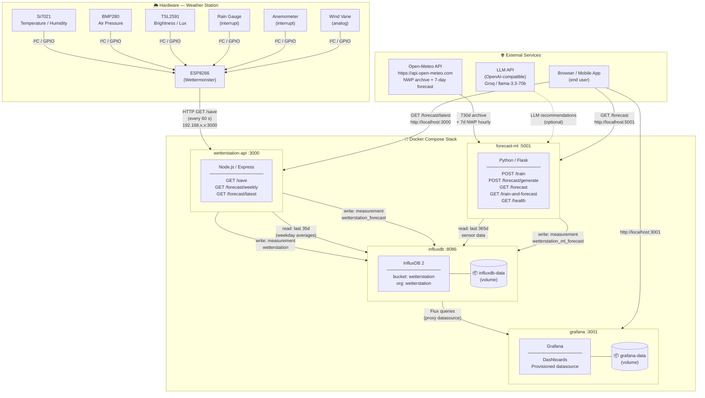

# System Architecture — Wetterstation Team 1

## Overview

The Wetterstation system collects real-time weather data from a physical sensor station (ESP8266 microcontroller), stores it in a time-series database, and serves both rule-based and ML-powered 7-day forecasts to a Grafana dashboard and mobile clients.

The backend runs entirely as a Docker Compose stack on a local server or any Docker-capable host.

---

## Architecture Diagram



---

## Services

| Service | Image / Build | Host Port | Container Port | Role |
|---|---|---|---|---|
| `influxdb` | `influxdb:2` | **8086** | 8086 | Time-series database — persists all sensor readings and forecasts |
| `grafana` | `grafana/grafana:latest` | **3001** | 3000 | Visualization dashboard; auto-provisioned with InfluxDB datasource |
| `wetterstation-api` | `./api` (Node.js) | **3000** | 3000 | Data ingestion API + rule-based 7-day forecast engine |
| `forecast-ml` | `./forecast-ml` (Python) | **5001** | 5000 | ML forecast service (NWP bias-correction + Holt-Winters fallback) |

All four services share the default Docker Compose bridge network and address each other by service name (e.g. `http://influxdb:8086`).

---

## Hardware Layer

The **ESP8266** (Wettermonster) microcontroller reads from five sensor modules every **60 seconds** and pushes the data to the API via a plain HTTP GET request over the local Wi-Fi network.

| Sensor | Module | Measurements |
|---|---|---|
| Temperature & Humidity | Adafruit Si7021 | `temperatur` (°C), `luftfeuchtigkeit` (%) |
| Air Pressure | Adafruit BMP280 | `luftdruck` (hPa) |
| Brightness / Lux | Adafruit TSL2591 | `helligkeit` (lux) |
| Rain Gauge | Tipping bucket (interrupt pin 2) | `niederschlag` (mm/h) |
| Anemometer | Rotary (interrupt pin 14) | `windgeschwindigkeit` (km/h) |
| Wind Vane | Resistive / analog (pin A0) | `windrichtung` (compass: N, NE, …) |

---

## Data Model (InfluxDB)

All data lives in the `wetterstation` bucket inside the `wetterstation` organisation.

### Measurement: `wetterstation`
Written by **wetterstation-api** on every sensor push.

| Field | Type | Unit | Description |
|---|---|---|---|
| `temperatur` | float | °C | Air temperature |
| `luftfeuchtigkeit` | float | % | Relative humidity |
| `luftdruck` | float | hPa | Atmospheric pressure |
| `niederschlag` | float | mm/h | Precipitation rate |
| `windgeschwindigkeit` | float | km/h | Wind speed |
| `helligkeit` | float | lux | Brightness |
| `windrichtung` | string | compass | Wind direction (e.g. `NW`) |

Tags: `id` (station ID)

---

### Measurement: `wetterstation_forecast`
Written by **wetterstation-api** (rule-based engine, tag `source=v1`).

Contains 7 daily forecast rows per run, each with numeric weather fields plus:

| Field | Type | Description |
|---|---|---|
| `workout` | string | Recommended workout (e.g. `Lockerer Lauf (35 min)`) |
| `drink` | string | Recommended drink (e.g. `Wasser mit Zitrone (400 ml)`) |
| `rationale` | string | Human-readable reasoning |

Tags: `source` (`v1`), `date` (ISO date string)

---

### Measurement: `wetterstation_ml_forecast`
Written by **forecast-ml** (tag `source=prophet`).

168 hourly data points covering the next 7 days, with the same numeric weather fields as `wetterstation`. The service deletes and rewrites this measurement on every `POST /forecast/generate` call.

---

## Data Flows

### 1 — Sensor ingestion
```
ESP8266  ──(HTTP GET /save?temperatur=…)──►  wetterstation-api  ──(write)──►  InfluxDB
```

### 2 — Rule-based weekly forecast (wetterstation-api)
```
InfluxDB (last 35 d, weekday averages)  ──►  wetterstation-api  ──►  7-day forecast
                                                                           │
                                    (write: wetterstation_forecast) ◄──────┘
```
Triggered once on API startup and then every 24 hours. Also callable via `GET /forecast/weekly`.

### 3 — ML forecast (forecast-ml)
```
Open-Meteo Archive (730 d)  ─┐
                               ├──►  merge + downsample  ──►  Holt-Winters fit  ──►  bias
InfluxDB sensor (365 d)  ────┘                                                         │
                                                POST /train                             │
                                                                                        ▼
Open-Meteo NWP forecast (7 d, hourly)  ─────────────────────────────►  + bias  ──►  InfluxDB
                                                POST /forecast/generate                 │
                                                                                        │
                                          GET /forecast  ◄──────────────────────────────┘
```
The service auto-trains on startup in a background thread.

### 4 — Visualization
```
InfluxDB  ──(Flux queries)──►  Grafana  ──(HTTP :3001)──►  Browser
```
Grafana is pre-configured with the InfluxDB datasource via `grafana/provisioning/datasources/influxdb.yml`.

---

## API Endpoints

### wetterstation-api (`:3000`)

| Method | Path | Description |
|---|---|---|
| `GET` | `/save` | Ingest one sensor reading (query-string params) |
| `GET` | `/forecast/weekly` | Trigger rule-based 7-day forecast generation + return result |
| `GET` | `/forecast/latest` | Return last stored forecast rows from InfluxDB |

### forecast-ml (`:5001`)

| Method | Path | Description |
|---|---|---|
| `GET` | `/health` | Service and training status |
| `POST` | `/train` | (Re-)train bias-correction model |
| `POST` | `/forecast/generate` | Fetch NWP, apply bias, write 168 h to InfluxDB |
| `GET` | `/forecast` | Return stored 7-day hourly forecast (read-only) |
| `GET` | `/train-and-forecast` | Train + generate in one call |

---

## Docker Volumes

| Volume | Mounted into | Purpose |
|---|---|---|
| `influxdb-data` | `/var/lib/influxdb2` | Persistent InfluxDB storage |
| `grafana-data` | `/var/lib/grafana` | Grafana database and plugins |

Bind mount: `./grafana/provisioning` → `/etc/grafana/provisioning` (datasource auto-configuration).

---

## Environment Variables

| Variable | Used by | Description |
|---|---|---|
| `INFLUX_URL` | api, forecast-ml | InfluxDB base URL (`http://influxdb:8086`) |
| `INFLUX_TOKEN` | api, forecast-ml, grafana | InfluxDB API token |
| `INFLUX_ORG` | api, forecast-ml | InfluxDB organisation (`wetterstation`) |
| `INFLUX_BUCKET` | api, forecast-ml | InfluxDB bucket (`wetterstation`) |
| `LLM_API_KEY` | forecast-ml | API key for optional LLM recommendations |
| `LLM_BASE_URL` | forecast-ml | LLM base URL (default: Groq) |
| `LLM_MODEL` | forecast-ml | LLM model name (default: `llama-3.3-70b-versatile`) |
| `GF_SECURITY_ADMIN_USER` | grafana | Grafana admin username |
| `GF_SECURITY_ADMIN_PASSWORD` | grafana | Grafana admin password |
